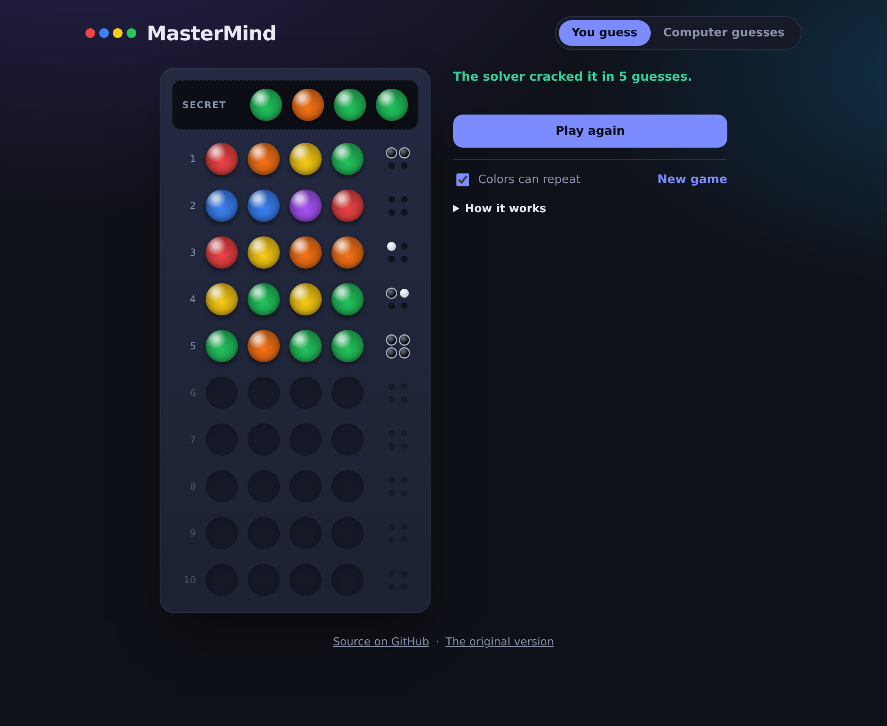
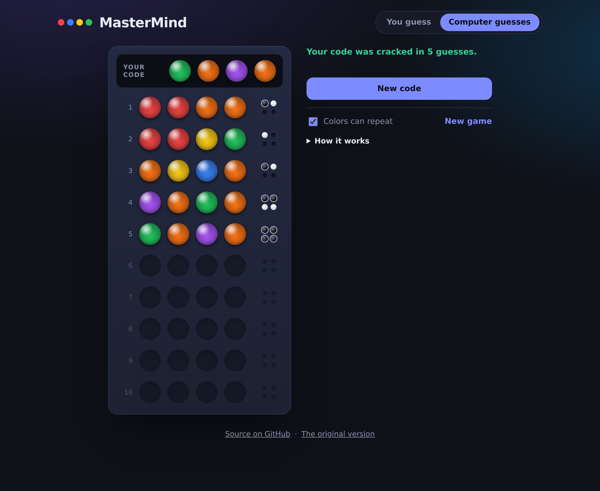
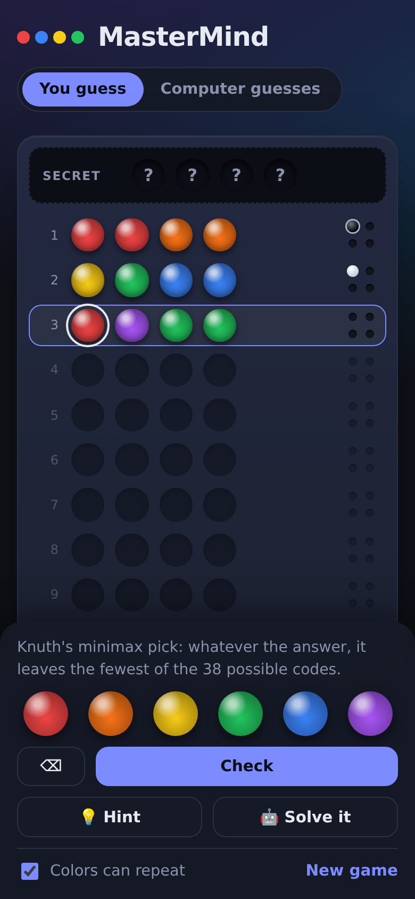

# MasterMind

**[Play it live →](https://izikstar.github.io/MasterMindTS/)**

The classic code-breaking game in TypeScript, with a built-in solver based on Donald Knuth's 1977 minimax algorithm. It cracks any of the 1,296 possible codes in at most five guesses, and you can watch it do so, ask it for a hint, or hand it your own code to break.

<p align="center">
  
  
</p>

## Features

- **You guess:** crack a hidden code of 4 pegs from 6 colors in 10 tries. Black pin = right color, right spot; white pin = right color, wrong spot.
- **💡 Hint:** fills in the guess the solver would play and tells you how many codes are still possible.
- **🤖 Solve it:** the solver finishes the game for you, one guess at a time.
- **Computer guesses:** pick a secret and watch the computer break it, or keep it in your head and score its guesses yourself. If your scores contradict each other, it notices and lets you undo.
- **Colors can repeat** toggle (classic rules) or unique colors only (how the original version played).
- Works with mouse, touch and keyboard (`1`–`6`, `⌫`, `Enter`, `H`), and on phones.



## How the solver works

Every guess splits the codes that are still possible into groups by the feedback they would produce. The solver ([`src/engine/solver.ts`](src/engine/solver.ts)) tries all 1,296 legal guesses, finds each one's largest group (its worst case), and plays the guess whose worst case is smallest. Ties go to a guess that could itself be the secret, so it might win on the spot.

To keep that fast in the browser, the feedback for every pair of codes is precomputed once into a 1296 × 1296 byte table, so the inner loop is a table lookup. A hint takes a few milliseconds.

The test suite plays all 1,296 games:

| Rules                       | Codes | Worst case | Average |
| --------------------------- | ----- | ---------- | ------- |
| Colors can repeat (classic) | 1,296 | 5 guesses  | 4.476   |
| Unique colors               | 360   | 5 guesses  | 4.139   |

4.476 is the figure Knuth published.

## Project structure

```
src/engine/code.ts     scoring, code enumeration, validation
src/engine/solver.ts   Knuth minimax solver
src/engine/game.ts     game state for both modes (no DOM, fully tested)
src/main.ts            rendering and input
tests/                 Vitest: scoring edge cases, solver on every code, game flow
public/legacy/         the original version, kept for comparison
```

## Running locally

```bash
npm install
npm run dev     # http://localhost:5173
npm test        # 22 tests, including the solver against every code
npm run build
```

CI runs formatting, type checking, tests and the build on every push and pull request, and deploys `main` to GitHub Pages.

## History

This started as a single HTML file with Tailwind from a CDN ([still playable here](https://izikstar.github.io/MasterMindTS/legacy/index.html)). The rewrite moved it to TypeScript and Vite, separated the game logic from the UI so it could be tested, added the classic repeated-colors rule, and added the solver.
